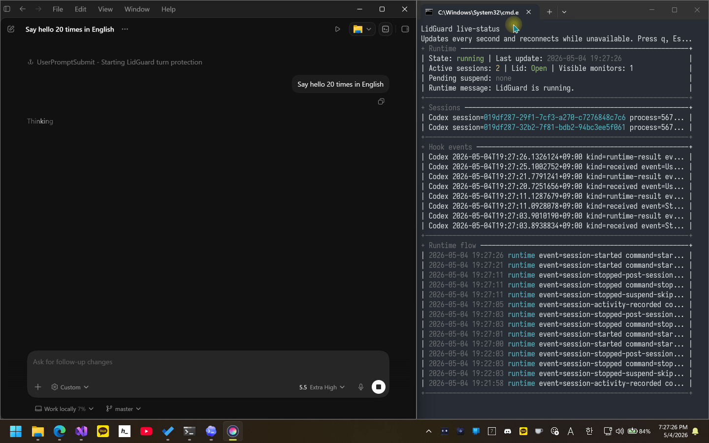

# Keep the agent awake, even when the lid closes.

[](https://www.nuget.org/packages/lidguard)
[](https://www.nuget.org/packages/lidguard)
[](https://github.com/airtaxi/LidGuard/actions/workflows/pack-and-publish.yml)
[](LICENSE.txt)

🌐 English | [한국어](README.ko.md)

LidGuard lets long-running local AI coding agents keep working after you close your laptop lid. It tracks Codex, Claude Code, and GitHub Copilot CLI sessions, temporarily prevents idle sleep and lid-close sleep while protected work is active, then restores the original operating system power policy when that work finishes or becomes suspend-eligible.

Most keep-awake tools protect a process, a timer, or the whole machine. LidGuard protects an AI coding agent session, so the workflow is simpler: start the agent, close the lid when the device is safe to leave running, and let LidGuard release protection or enter Sleep/Hibernate when the work is done.

## Demo



## Highlights

- Agent-aware sleep prevention for Codex, Claude Code, and GitHub Copilot CLI.
- Optional lid-close protection so protected agent work can continue after the laptop closes, with automatic restoration of the original OS policy.
- Windows-to-WSL hook and MCP setup, so providers running inside WSL can call the Windows LidGuard runtime without installing LidGuard inside the distro.
- Automatic Sleep or Hibernate after protected sessions finish, helping avoid unnecessary battery drain.
- Ask-before-sleep replies, so LidGuard can ask before sleeping and keep the session alive when you reply.
- Cross-platform power control for Windows, systemd/logind Linux, and macOS.
- Safety controls such as SoftLock, inactive timeout, pre-suspend hooks, diagnostics, and emergency hibernation.

## Why LidGuard?

Generic keep-awake tools are good at preventing idle sleep, but they are not built around the moment you want to close a laptop and leave an agent running. LidGuard is designed for that narrower workflow: start protection when a local AI coding agent begins work, keep it only while the agent still needs the machine awake, and release it when the agent finishes or becomes suspend-eligible.

If LidGuard temporarily changes lid-close behavior, it restores the user's original operating system policy afterward. If configured, it can request Sleep or Hibernate after completion. The goal is to preserve long-running local agent work without leaving the laptop awake longer than necessary. LidGuard targets Windows, systemd/logind Linux, and macOS rather than acting as a single-platform workaround.

## Install

### Let Your Agent Install It

LidGuard is built for local AI agents, so letting an agent install the agent-awake tool is a fairly reasonable division of labor. Hand it the prompt below, grant command execution when it asks, and let it check .NET, install the NuGet tool, wire provider hooks/MCP, and walk you through the safety settings.

For most agents:

```text
Read https://raw.githubusercontent.com/airtaxi/LidGuard/master/.github/agent-install.md and install LidGuard for this machine. You may run the commands needed for installation after explaining them, and you should ask me before any administrator, sudo, password, provider hook, MCP, or safety-related settings step.
```

For Codex, start with `/plan` so it can use its interactive question flow:

```text
/plan
Read https://raw.githubusercontent.com/airtaxi/LidGuard/master/.github/agent-install.md and install LidGuard for this machine. You may run the commands needed for installation after explaining them, and you should ask me before any administrator, sudo, password, provider hook, MCP, or safety-related settings step.
```

The agent-facing instructions live at [.github/agent-install.md](.github/agent-install.md).

After hooks or MCP servers are installed, the current conversation might not pick them up immediately. Start a new provider session or conversation when you want to verify the integration.

### Manual Install

```powershell
dotnet tool install --global lidguard
```

```powershell
lidguard help
lidguard hook-install --provider all
lidguard mcp-install all
```

### Webhook Notification Server

LidGuard can send pre-suspend, post-session-end, and ask-before-sleep reply events to an optional companion server. `LidGuard.Notifications` receives those webhooks, forwards Web Push notifications to subscribed browsers, and lets you reply from a small dashboard when a follow-up response is needed.

For setup, security notes, and deployment details, see the [LidGuard.Notifications README](LidGuard.Notifications/README.md).

### Ask Before Sleep Replies

When a closed-lid session reaches the point where LidGuard would normally let the machine sleep, it can pause briefly and ask for one last instruction first. If you reply from the notification dashboard, LidGuard keeps the session alive and hands that reply back to the provider instead of ending the flow immediately.

This is useful for long-running coding or agent tasks where "done" sometimes means "almost done, but I need your call." You can keep the reply window short, extend it from the dashboard when needed, or cancel the wait and let the normal sleep path continue.

With repeat replies enabled, that can become a lightweight back-and-forth loop: the laptop can stay closed in your bag while you keep nudging follow-up work from your phone or browser, without opening the machine just to type the next instruction.

### Windows WSL Integration

On Windows, LidGuard can also install hook, MCP, and Provider MCP configuration inside WSL distributions. Nothing needs to run or be installed as a separate LidGuard binary inside WSL. The WSL-side provider config points back to the current Windows `lidguard.exe` through its `wslpath`-converted absolute path.

```powershell
lidguard wsl-hook-install --provider all
lidguard wsl-mcp-install all
lidguard wsl-provider-mcp-install --config "~/.example/mcp.json" --provider-name "ExampleProvider"
```

Pass `--distro <name>` to target a specific distribution. If `--distro` is omitted, LidGuard lets `wsl.exe` use the default distribution.

### Provider MCP For Other Agents

If an AI tool does not have a native LidGuard hook integration but can register a custom stdio MCP server, use Provider MCP as a best-effort integration path:

```powershell
lidguard provider-mcp-install --config "C:\path\to\mcp.json" --provider-name "ExampleProvider"
```

After registering the server, give the model [ProviderMcpModelPrompt.md](ProviderMcpModelPrompt.md) as its provider/session instruction so it knows when to call `provider_start_session`, `provider_set_soft_lock`, `provider_clear_soft_lock`, and `provider_stop_session`.

Provider MCP behavior is not guaranteed. Correct operation depends entirely on the model choosing to call the LidGuard MCP tools at the right times, and it does not expand LidGuard's operating system support beyond Windows, systemd/logind Linux, and macOS. Ask-before-sleep replies are not implemented for Provider MCP and are not supported there.

## Current Support Status

LidGuard is currently officially tested with Codex on Windows. Linux, macOS, Claude Code, and GitHub Copilot CLI support are implemented, but broader real-world validation is still ongoing. Reports and pull requests are welcome.

## Full Feature Overview

- Session tracking and status: active session count, provider/session identity, watched process id, SoftLock state, working directory, local start and last-activity times, current lid state, visible display monitor count, and a live terminal status dashboard.
- Provider integration: Codex, Claude Code, and GitHub Copilot CLI hooks; hook install/status/remove/events commands; regular MCP install/status/remove commands; Windows WSL hook/MCP setup commands; and Provider MCP for other tools that can call a custom stdio MCP server.
- Keep-awake controls: configurable system sleep prevention, display sleep prevention, Windows away-mode requests, and the Windows power request reason text shown by the operating system.
- Lid-close handling: temporary Windows lid-action override, Linux `handle-lid-switch` inhibitor, macOS `pmset disablesleep`, and restoration of the user's original policy after protection ends or recovery runs.
- Process and runtime cleanup: parent-process watching, orphan cleanup, inactive-session timeout SoftLocking, and automatic runtime exit after the configured cleanup delay once all sessions are gone.
- Completion suspend flow: configurable Sleep or Hibernate, post-stop suspend delay in seconds, cancellation when sessions resume or the environment is no longer suspend-eligible, and recent suspend history retention.
- Ask-before-sleep replies: optional notifications when a closed-lid session tries to finish. A reply keeps the session alive, and the default setting asks again if that continued work later tries to finish again.
- Pre-suspend audio warning: optional off/system-sound/`.wav` warning sound before Sleep or Hibernate, plus an optional temporary master volume override from 1 through 100 percent that restores the previous volume and mute state afterward.
- SoftLock and closed-lid permissions: provider waiting/input events and inactive timeouts can release keep-awake protection without removing the session. Closed-lid PermissionRequest can `deny`, `allow`, or `ask`; `ask` soft-locks the session and leaves the provider's normal prompt in control, while `allow` can approve permission-required work when the user may not be watching. The safer default is `deny`.
- Emergency Hibernation: optional closed-lid high-temperature monitor with low, average, or high sensor aggregation, a configurable Celsius threshold, immediate Hibernate, and Sleep fallback if Hibernate fails.
- Webhooks and notifications: before-sleep webhooks, normal-completion webhooks, ask-before-sleep reply notifications, and the optional `LidGuard.Notifications` Web Push companion server.
- Diagnostics and logs: current lid state, visible monitor count, current temperature, live-status dashboard, suspend-history diagnostics, hook event logs, session execution logs, exception logs, and configurable suspend history count.
- Platform setup and localization: Linux polkit helper commands, macOS sudoers helper commands, localized CLI output with `auto`, `en`, `ko`, or another culture name, and default settings/log storage under the platform local application data directory.
- Packaging: .NET 10 NativeAOT global tool distribution for Windows, systemd/logind Linux, and macOS.

## Documentation

- [CLI details](LidGuard/README.md)
- [Webhook notification server](LidGuard.Notifications/README.md)

## Safety And Responsibility

LidGuard is a power-management helper, not a guarantee that a laptop is safe to leave unattended in every environment. Do not put a running laptop in a bag, sleeve, drawer, or other heat-trapping space unless you have personally confirmed that the device is cool, stable, and safe.

Closed-lid permission automation is also a supervision risk. If you configure LidGuard to allow provider permission requests while the lid is closed, permission-required agent actions may proceed while you are not watching the machine. If you configure `ask`, cloud or desktop provider environments that do not expose a readable local transcript can only clear the soft-lock through observable activity/tool hooks, session updates, or cleanup paths.

SoftLock detection, provider hooks, process watchers, operating system behavior, CLI behavior, temperature sensors, permissions, firmware, and power policies can all fail or change in ways that prevent safety features from running as expected. Emergency hibernation and suspend flows are best-effort safeguards, not a substitute for checking the machine yourself.

If you enable ask-before-sleep replies, the laptop intentionally stays awake during the reply window before suspend. That extra wake time increases heat risk, so use short delays and monitor the machine carefully.

Managed hook cleanup uses the hook process ancestry to attach a watched parent process when possible, including Codex App `app-server`, Codex CLI, Claude Code, and GitHub Copilot CLI owners. Working directory is kept for status, logs, transcript fallback, and webhook metadata; it is not used to find a watched process. If the watched parent exits, LidGuard treats that as cancel cleanup rather than a provider-reported normal session end, suppressing `PostSessionEnd` and any new `PreSuspend` webhook that cleanup would otherwise schedule.

You are responsible for monitoring device state and heat risk. Device damage, data loss, property damage, or other loss caused by ignoring those risks is your responsibility.

## Localization

English and Korean are directly maintained and reviewed by the developer. Other languages rely on machine translation because the developer cannot verify them.

If you would like to propose adding a new language or suggest corrections to translations, please open an Issue. If you are a native speaker of that language and can verify the translation, Pull Requests (PRs) are also welcome!

## Contributing

Pull requests are welcome. Please keep changes focused, test behavior that touches power control carefully, and avoid committing secrets or local machine configuration.

## License

LidGuard is licensed under the [MIT License](LICENSE.txt).

## Author

Created by [Howon Lee (airtaxi)](https://github.com/airtaxi).

Built with help from OpenAI Codex.
